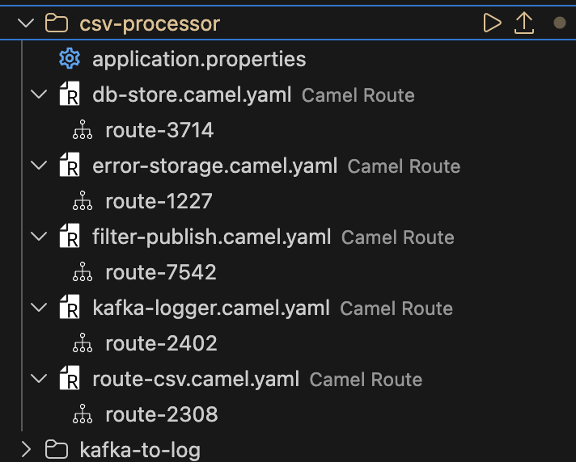

# Demo: CSV Processor

## Purpose

The purpose of this demo is to combine different Enterprise Integration Patterns (EIPs) to process a CSV file. This demo uses the Synthea patient dataset [^1].

## Prerequisites

1. **CSV file**: patients.csv downloaded from this [link](https://mavenanalytics.io/data-playground/hospital-patient-records) and that looks like the following:

| Id | BIRTHDATE | DEATHDATE | PREFIX | FIRST | LAST | SUFFIX | MAIDEN | MARITAL | RACE | ETHNICITY | GENDER | BIRTHPLACE | ADDRESS | CITY | STATE | COUNTY | ZIP | LAT | LON |
|---|---|---|---|---|---|---|---|---|---|---|---|---|---|---|---|---|---|---|---|
| 5605b66b-e92d-c16c-1b83-b8bf7040d51f | 1977-03-19 | | Mrs. | Nikita578 | Erdman779 | | Leannon79 | M | white | nonhispanic | F | Wakefield  Massachusetts  US | 510 Little Station Unit 69 | Quincy | Massachusetts | Norfolk County | 02186 | 42.290937381211286 | -70.97550306 |

2. **Kafka cluster** - Choose one option:
   - Use the provided compose file: `podman-compose -f kafka-postgres.compose.yaml up -d`
   - Use Camel testcontainers: `camel infra run kafka`

3. **Postgres database** - Choose one option:
   - Use the provided compose file (same as above)
   - Use Camel testcontainers: `camel infra run postgres`

4. **Create a table** with the following query (for simplification, only id, birthdate and ZIP will be used):

```sql 
CREATE TABLE patients (    
    id character(64) NOT null,
    birthdate character(10),
    ZIP character(5)
);
```

5. **Kaoto UI**: install Kaoto according to the instruction in the [installation guide](https://kaoto.io/docs/installation/)

**Security Note**: This demo uses the debezium/kafka image in the compose file for ease of local setup. A scan might show vulnerabilities in lz4-java or log4j. These are non-critical for local development as the broker is only exposed on localhost and not intended for production traffic.

## Workflow

1. **CSV Ingestion** ([`route-csv.camel.yaml`](route-csv.camel.yaml))
   - Reads the CSV file from the local directory
   - Splits the file into individual patient records
   - Routes each record to the filter stage
   - Moves the file to done directory once the processing is finished

2. **Data Filtering** ([`filter-publish.camel.yaml`](filter-publish.camel.yaml))
   - Filters patients based on ZIP code presence
   - Valid records (with ZIP) → routed to database storage and published to Kafka for monitoring
   - Invalid records (missing ZIP) → routed to error handling

3. **Database Storage** ([`db-store.camel.yaml`](db-store.camel.yaml)) 
   - Stores valid records in Postgres

4. **Error Handling** ([`error-storage.camel.yaml`](error-storage.camel.yaml)) 
   - Writes invalid records to error files

5. **Kafka Monitoring** ([`kafka-logger.camel.yaml`](kafka-logger.camel.yaml))
   - Logs all valid records via Kafka consumer

## Running the Demo

1. Place your CSV file in `test-file/` directory
2. Start the infrastructure: `podman-compose -f kafka-postgres.compose.yaml up -d`
3. Update the `application.properties` file with the correct credentials for Postgres and Kafka if changed
4. Create the patients table in Postgres
5. Run Kaoto UI and run the routes in the same Camel context by clicking in the play icon next to the name of the folder:



6. Monitor the output:
   - The processed CSV file will be moved to `test-file/done/` directory
   - Valid records appear in Postgres `patients` table
   - Invalid records are written into files in the `errors/` directory
   - All valid records are logged via Kafka consumer

7. To stop the infrastructure once the process is finished: `podman-compose -f kafka-postgres.compose.yaml down`


## References

[^1]: Jason Walonoski, Mark Kramer, Joseph Nichols, Andre Quina, Chris Moesel, Dylan Hall, Carlton Duffett, Kudakwashe Dube, Thomas Gallagher, Scott McLachlan, Synthea: An approach, method, and software mechanism for generating synthetic patients and the synthetic electronic health care record, <strong>Journal of the American Medical Informatics Association</strong>, 25(3), 230–238, 2018.